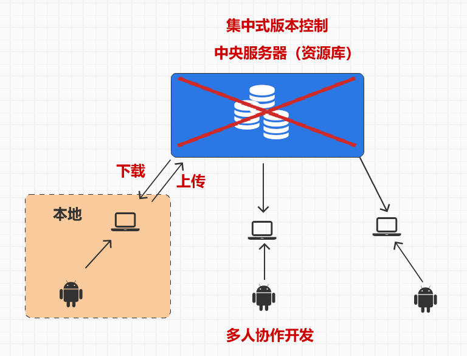
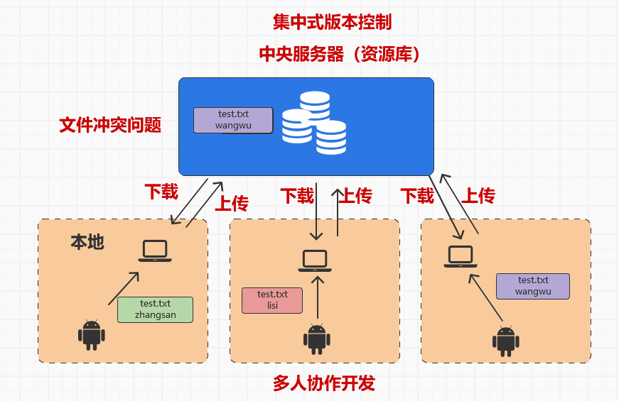
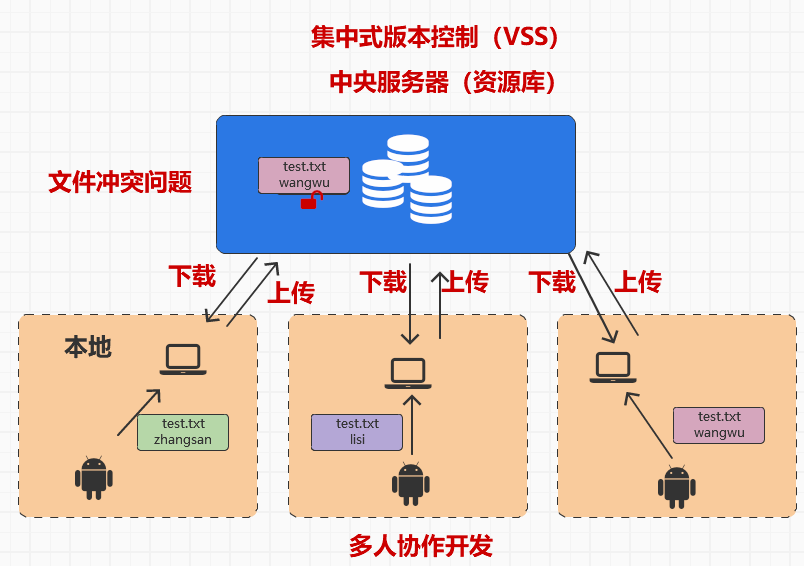
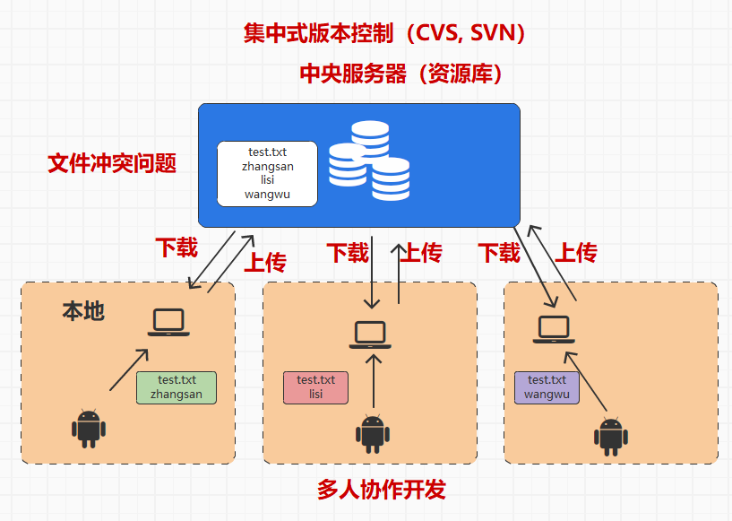
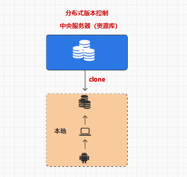
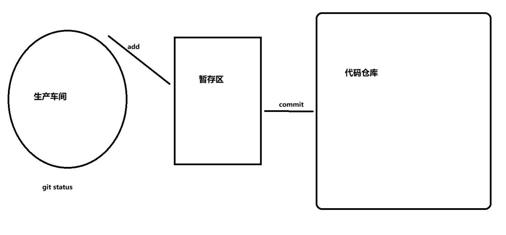
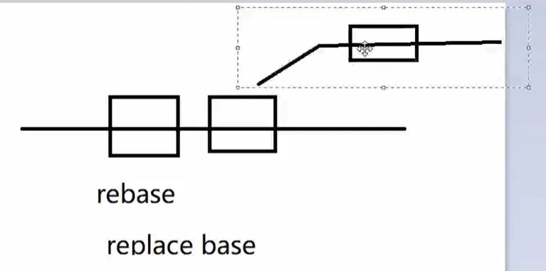

# Git

## 目录

- [资源网址](#资源网址)
- [集中式](#集中式)
- [文件冲突](#文件冲突)
- [VSS软件](#VSS软件)
- [CVS, SVN](#CVS-SVN)
- [分布式](#分布式)
- [基本命令](#基本命令)
- [工作区](#工作区)
- [暂存区](#暂存区)
- [reset](#reset)
- [日志查看](#日志查看)
- [文件操作](#文件操作)
- [远程仓库](#远程仓库)
- [分支管理](#分支管理)
- [Stashing](#Stashing)
- [配置文件](#配置文件)
- [别名操作](#别名操作)
- [版本冲突](#版本冲突)
- [Tag标签](#Tag标签)
- [打包压缩](#打包压缩)
- [SSH](#SSH)

## 资源网址

- Git下载地址 [https://git-scm.com/](https://git-scm.com/ "https://git-scm.com/")
- 码云社区 [https://gitee.com/](https://gitee.com/ "https://gitee.com/")
- Github [https://github.com/](https://github.com/ "https://github.com/")
- 客户端软件：[https://git-scm.com/downloads/guis](https://git-scm.com/downloads/guis "https://git-scm.com/downloads/guis")
- [https://www.progit.cn/](https://www.progit.cn/ "https://www.progit.cn/")

```javascript
认识 git
  + 分布式版本管理器
  + 管理的是你的文件夹
    => 版本管理(创建, 穿越)
    => 上传下载
    => 分布式(协同开发)

认识 github
  + 远程仓库
  + 特点: 只接受 git 上传内容
  + 是一个社区

认识 gitee(码云)
  + 远程仓库
  + 特点: 只接受 git 上传内容

安装 git
  + 依赖 电脑操作系统 运行的
  + 官网下载安装包
  + 双击安装, 一路下一步
  + 完成

检测 git
  + 方式1:
    => 空白位置鼠标右键
    => 出现 git bash here 和 git gui here 表示安装成功
  + 方式2:
    => 打开命令行, 目录无所谓
    => 输入指令: git --version

```

## 集中式

> 中央服务器一坏，直接完蛋



## 文件冲突

> 谁后，谁就会覆盖前者



## VSS软件

> 文件上锁，但只能担任操作多人查看



## CVS, SVN

> 对每一行进行比对，然后都写上去，对同一行进行修改就完蛋了



## 分布式





## 基本命令

```bash
#查看版本号，验证安装
git -version

#配置作者信息,当然你也可以把global去掉，用来设置项目用户
git config --global user.email "zhaoxinkun1124@gmail.com"
git config --global user.name "zhaoxinkun"

#初始化仓库
git init 
=> 注意: 不要出现父子结构都有 .git 的情况

#克隆代码
git clone ...
+ 后续拉取
  => 打开命令行, 切换目录到项目更目录(你上回 clone 下来的那个目录内)
  => 输入指令: git pull
 

```

## 工作区

```bash
#是一次 clean 的演习, 告诉你哪些文件会被删除
git clean -n 

#删除当前目录下没有 tracked 过的文件，不会删除.gitignore 指定的文件
git clean -f 

#删除当前目录下没有被 tracked 过的文件和文件夹
git clean -df 

#将没有放入到暂存区的所有文件恢复
git checkout . 

# 放弃指定文件的修改
git checkout hd.js

#将文件从暂存区恢复（如果没有提交到暂存区，将恢复到最近版本）
git checkout -- hd.js 

```

## 暂存区

```bash
#提交单个文件
git add 文件名/文件夹名称

#提交所有文件
git add .
git add --all

#只提交修改文件不提交新文件
git add -u 

#查看暂存区文件列表
git ls-files -s 

#查看暂存区文件内容
git cat-file -p 6e9a94 

#提交到仓库中
git commit -m "提示信息"
#修改最新一次提交的信息
git commit --amend

#提交到远程仓库
git push

#查看状态
git status

#撤销操作
git rm --cached a.js

```

## reset

reset 有三个选项可使用

1. **--hard** 重置位置的同时，直接将 **working Tree 工作目录**、 **index 暂存区**及 **repository** 都重置成目标**Reset**节点的內容
2. **--soft** 重置位置的同时，保留**working Tree 工作目录**和**index 暂存区**的内容，只让**repository**中的内容和 **reset** 目标节点保持一致
3. **--mixed（默认）** 重置位置的同时，只保留**Working Tree 工作目录**的內容，但会将 **Index 暂存区** 和 **Repository** 中的內容更改和 reset 目标节点一致

示例：

1. `git reset` 将 add 到暂存区的内容回退
2. `git reset --hard b7b73147ca8d6fc20e451d7b36` 恢复到指定提交版本（先通过 git log 查看版本号)，重置 stage 区和工作目录里的内容。
3. `git reset --hard HEAD^^^` 恢复前三个版本
4. `git reset --soft` 保留工作区的内容，只回退 commit 的动作。保留 **working tree 工作目录**的內容，**index 暂存区**与 **working tree** 工作目录的內容一致，只是仓库**repository** 中的內容的改变。
5. `git reset HEAD -- .` 撤销暂存区的文件
6. `git reset --hard` 清空工作区和暂存区的改动
7. `git reset HEAD hd.js` 放弃已经 add 暂存区的文件 hd.js

```bash
#撤销上次提交到暂存区动作
git reset 
将暂存区内容还原到工作区
+ 打开命令行, 切换目录到项目根目录
+ 输入指令:
  -> 撤回单文件: git reset HEAD -- 文件名
  -> 撤回单文件夹: git reset HEAD -- 文件夹名
  -> 撤回全部文件: git reset HEAD -- .
```

## 日志查看

```bash
#查看日志
git log 

#查看变动信息
git log -p

#查看最近一变动信息
git log -p -1

#查看最近两变动信息
git log -p -2

#一行显示并只显示 SHA-1 的前几个字符
git log --oneline
git log --oneline -p

#查看那些文件发生了变化
git log --name-only

#查看你文件修改变化信息
git log --name-status
```

自定义精简版日志信息输出格式

```bash
git log --graph --pretty=format:'%Cred%h%Creset -%C(yellow)%d%Creset %s %Cgreen(%cr) %C(bold blue)<%an>%Creset' --abbrev-commit
```

## 文件操作

```bash
#创建文件
touch 文件名.文件类型

#删除文件（远程和本地都会消失）
git rm read.txt

#仅删除远程仓库文件
git rm  --cached read.txt

#修改文件名
git mv <old_filename> <new_filename>
git mv c.js cj.js
#如果文件在暂存区，就要先把他拉出来，返回到生产车间去
git reset <filename>
#然后提交
git commit -m "Rename <old_filename> to <new_filename>"
#然后扔到远程
git push origin <branch_name>

```

## 远程仓库

```bash
#查看远程
git remote -v

#关联远程
+ 打开命令行, 切换目录到项目根目录
+ 输入指令: git remote add 变量名 地址

#推送远程
+ 保证本地有和远程不一样的版本
+ 注意: 把当前分支的内容, 上传到远程的某一个分支内容
+(如果远程没有这个分支, 会自动创建)
+ 首次推送
  => 打开命令行, 切换目录到项目根目录
  => 输入指令: git push -u 地址（origin） 分支(master)
+ 后期退从
  => 打开命令行, 切换目录到项目根目录
  => 输入指令: git push
  使用-u选项指定一个默认主机 ,这样以后就可以不加任何参数直播使用git push。
  => 注意: 首次推送需要加上 -u 指令才可以
  
删除远程ask分支 git push origin --delete ask

```

## 分支管理

```bash
1. 查看本地分支情况
  + 打开命令行, 切换目录到项目根目录
  + 输入指令: git branch 
  + 包含隐藏: git branch -a

2. 创建分支
  + 注意: 当你创建切换分支的时候, 保证当前分支干净
  + 打开命令行, 切换目录到项目根目录
  + 输入指令: git branch 分支名称
  + 注意: 你在哪一个分支上创建的新分支, 新分支的内容就是当前分支的复制版

3. 切换分支
  + 打开命令行, 切换目录到项目根目录
  + 输入指令: git checkout 分支名称
  +快速创建并进入分支 git checkout -b 名字

4. 合并分支
  + 注意: 我们合并方式只有一种, 你站在某一个分支上, 把别的分支的内容合并到自己身上
  + 打开命令行, 切换目录到项目根目录
  + 输入指令: git merge 你要合并的分支名称
  +他会把你的master分支的指针后移，把你的分支插入到前边

5.删除分支
  + git branch -d 分支名称
  强制删除分支
  + git branch -D 分支名称
   删除远程分支
  + git push origin --delete ask
  
6.查看已经合并的分支 
 + git branch --merged
 查看未合并的分支（因为你拓展了内容，所以指针后不同了）
 + git branch --no-merged
 
7.rebase处理分支,使分支的指针更新

8.更改主要分支
git branch -m main master

9.设置默认的远程分支，即push时使用的默认分支
git push --set-upstream origin dev

分支命名规范(建议你遵守)
  + 主分支: master
    => 不接受上传代码
    => 只接受 dev 分支合并
  + 主开发分支: dev development
    => 从 master 开辟的分支
    => 进行初始化 / 测试
    => 只接受功能分支合并的代码
    => 测试完毕后合并到 master 分支
  + 主功能分支: feature-xxx
    => 从 dev 分支开辟
    => 接受代码上传开发
    => 开发完毕后合并到 dev 分支
  + 紧急分支: hotfix-xxx
    => 可以临时从 master 上开辟
    => 开发完毕直接合并回到 master

```



## Stashing

临时存储

```bash
#在当前分支中，有内容add进入暂存区了，但是没有ocmmit，然后你想切换到别的分支是不可以的
#因为你没有保存和提交，但是我们可以创建临时存储区
储藏工作 git stash
查看储藏列表 git stash list
应用最近的储藏 git stash apply
应用更早的储藏 git stash apply stash@{2}
删除储藏git stash drop stash@{0}
应用并删除储藏 git stash pop
```

## 配置文件

.gitignore 用于定义忽略提交的文件

- 所有空行或者以注释符号 `＃` 开头的行都会被 Git 忽略。
- 匹配模式最后跟反斜杠（`/`）说明要忽略的是目录。
- 可以使用标准的 glob 模式匹配。

```bash
.idea
#忽略文件夹
/vendor

#忽略文件夹下的文件夹
/public/storage

#忽略文件夹下的某一个/所有文件
/public/index.js
/public/*.js

.env
/node_modules


 #忽略类型文件
*.txt
!a.txt
a.txt
```

```javascript

git 的三个独立文件

 1. .gitkeep 
  + 只有后缀没有名字的文件
  + 作用: 保持文件结构目录
  + 因为 git 不管空文件夹

 2. .gitignore 
  + 只有后缀没有名字的文件
  + 作用: 书写 git 忽略内容
  + 不需要 git 帮你管理的内容
  + 书写在项目根目录（新建一个文件夹，然后把不需要管的文件夹的名字扔进去）

 3. readme.md 
  + 在任何一个目录结构和根目录下都可以写一个 readme.md
  + 会在仓库内直接识别解析显示该文件内容
```

## 别名操作

```bash
#创建别名
git config --global alias.a add
```

修改配置文件 \~/.gitconfig 并添加以下命令别名配置段

```bash
[alias]
  a = add .
  c = commit
  s = status
  l = log
  b = branch

```

现在可以使用 `git a` 实现 `git add .` 一样的效果了。

window 用户可以修改`~/.bashrc` 或 `~/.bash_profile`文件。

mac/linux 修改 `~/.zshrc` 文件中定义常用的别名指令，需要首先安装 zsh 命令行扩展

```bash
alias gs="git status"
alias gc="git commit -m "
alias gl="git log --graph --pretty=format:'%Cred%h%Creset -%C(yellow)%d%Creset %s %Cgreen(%cr) %C(bold blue)<%an>%Creset' --abbrev-commit"
alias gb="git branch"
alias ga="git add -A"
alias go="git checkout"
alias gp="git push;git push github"
```

命令行直接使用 `gs` 即可以实现 `git status` 一样的效果了。

window 系统需要使用 git for window 中的 `Git Base` 软件

## 版本冲突

> 一个文件被不同的分支同时修改

```javascript
git 冲突
  + 原因: 在你的上传过程中, 本地 和 远程 版本不符合
  + 解决:
    => 让 远程 和 本地 的版本一致(git pull)
    => 然后在上传
   + 注意: 解决一个问题, 强制合并分支内容
    => 表示远程和本地两个分支没有关系
    => --allow-unrelated-historie
```

冲突的产生说白了，就是因为你本地有一个版本的，远程仓库有一个版本的，可能不是同一个文件，不是一个文件夹等，然后就不能同步

解决思路： git pull --allow-unrelated-historie—>然后git push origin master

强制下载，在上传合并

提交历史：一次是初始化，一次是添加，一次是上传

## Tag标签

Git 也可以对某一时间点上的版本打上标签 ，用于发布软件版本如 v1.0

1. 添加标签 `git tag v1.0`
2. 列出标签 `git tag`
3. 推送标签 `git push --tags`
4. 删除标签 `git tag -d v1.0.1`
5. 删除远程标签 `git push origin -d v1.0.1`

## 打包压缩

GIT 中可以使用 `git archive` 进行打包操作

将项目的 master 分支打包为 XXX.zip

```bash
git archive --format zip --output XXX.zip master
```

## SSH

```bash
生成密钥
ssh -keygen -t rsa
#一直按回车键直到结束。系统会在~/.ssh 目录中生成 id_rsa和id_rsa.pub，
#即密钥id_rsa和公钥id_rsa.pub。

#进入文件夹
cd ~/.ssh

#查看文件列表
ls

#打开id——rsa.pub
notepad++  id——rsa.pub
#复制就行了
```
